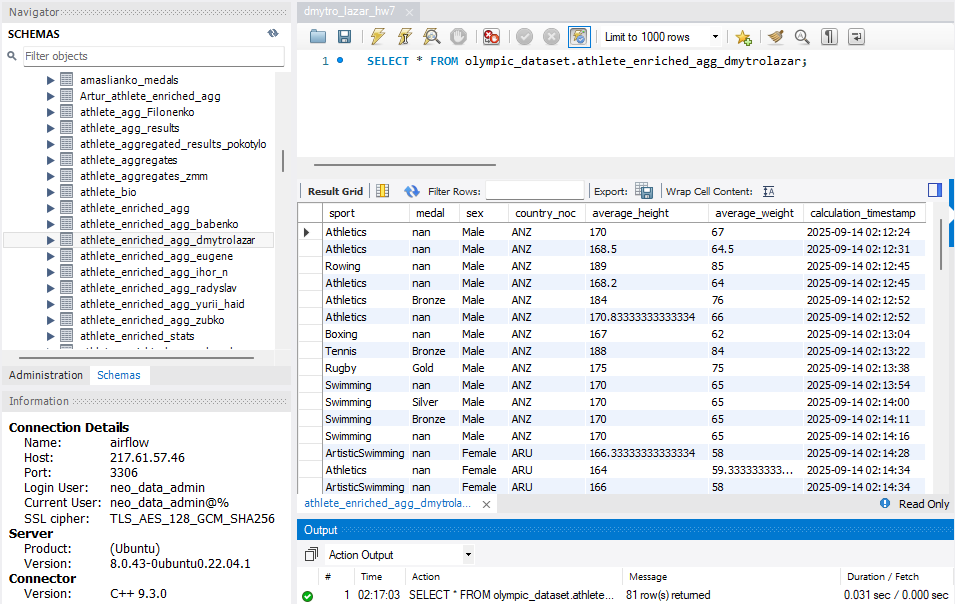
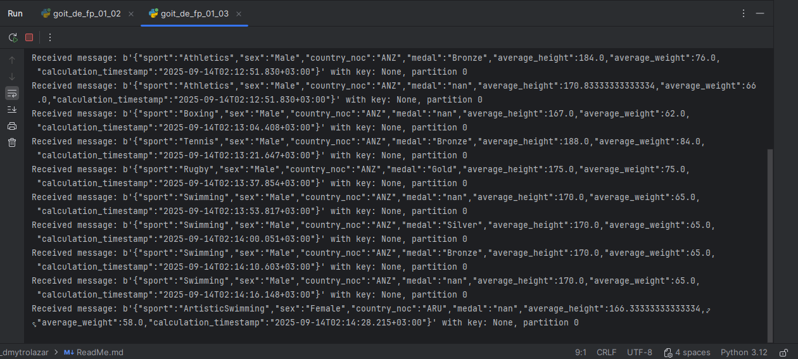
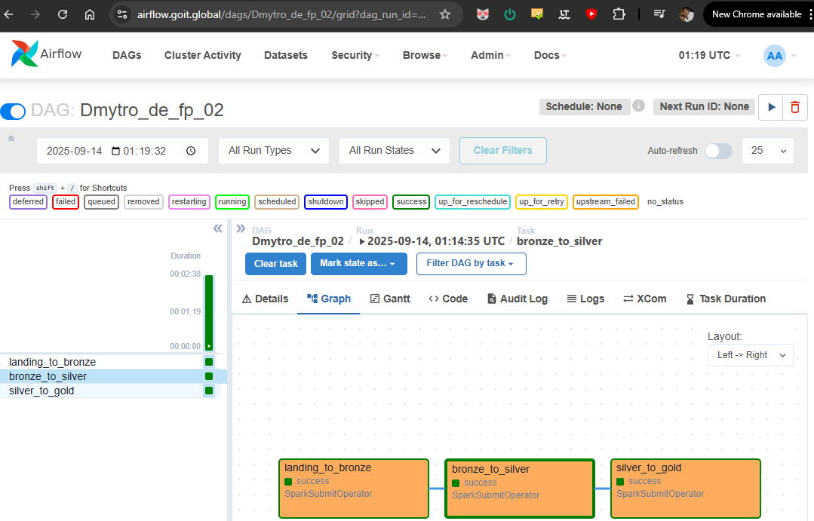
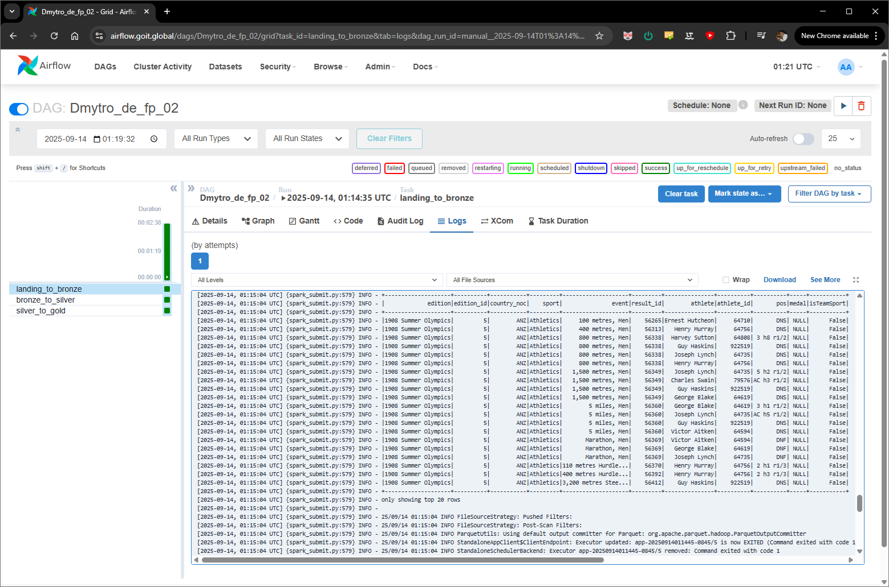
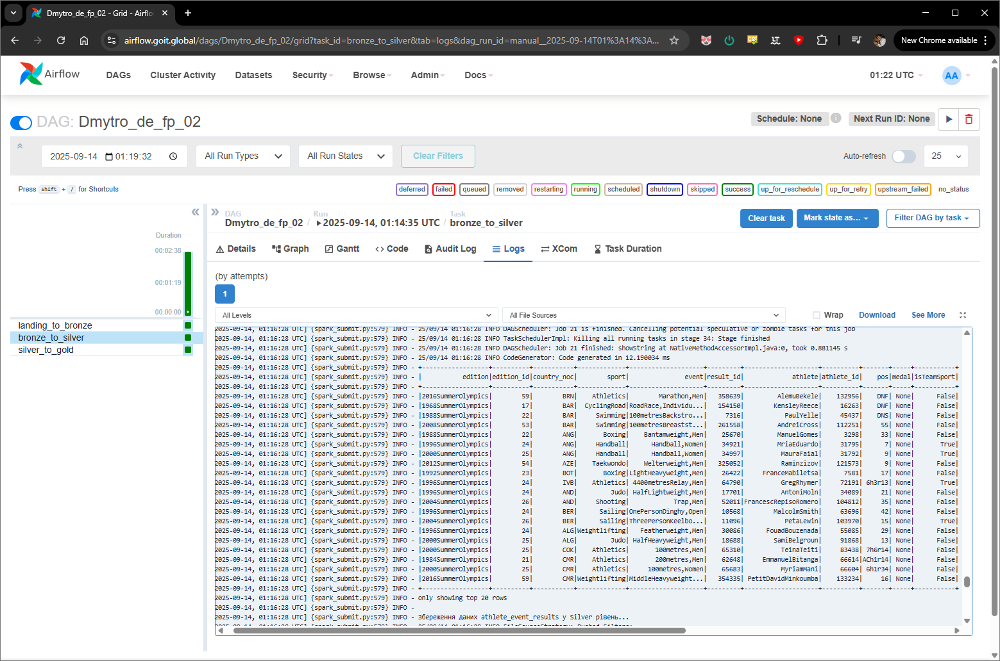
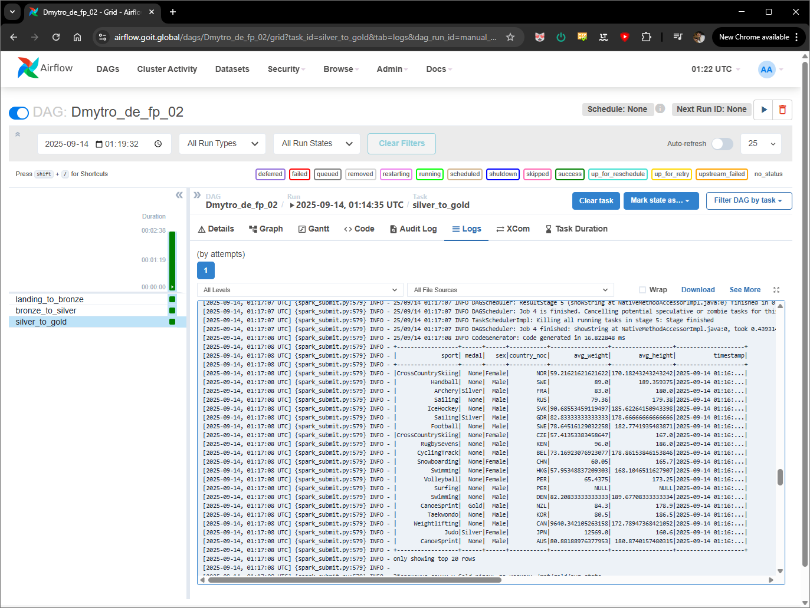

## Частина 1
В результаті виконання завдання я отримав наступні дані в приймачах:

1. В базі даних  

2. В Kafka топіку  

## Частина 2
1. Відпрацьований DAG.  

2. Таблиця в landing_to_bronze.  

3. Таблиця в bronze_to_silver.  

4. Таблиця в silver_to_gold.  
